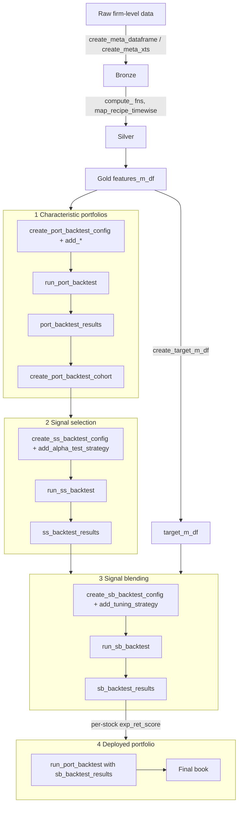

<!-- README.md is generated from README.Rmd. Please edit that file -->

```{r, include = FALSE}
knitr::opts_chunk$set(
  collapse = TRUE,
  comment = "#>",
  fig.path = "man/figures/README-",
  out.width = "100%"
)
```

# factoRverse 

<!-- badges: start -->
[](https://github.com/pauloguimaraes871/factoRverse/actions/workflows/R-CMD-check.yaml)
[](https://lifecycle.r-lib.org/articles/stages.html#experimental)
[](https://opensource.org/licenses/MIT)
<!-- badges: end -->

An end-to-end toolkit for **factor investing** research and deployment: engineer
point-in-time signals, tame the factor zoo with disciplined multiple-testing
inference, blend signals with machine learning, and build cost- and
constraint-aware portfolios, all through one consistent, auditable interface.


`factoRverse` takes a factor strategy from raw firm-level data all the way to a
deployable portfolio. It packages the modern asset-pricing workflow (anomaly
construction, the multiple-testing / factor-zoo debate, signal blending, and
risk-based portfolio construction) into small, composable, testable functions,
with strict guardrails against the two cardinal sins of backtesting:
**look-ahead bias** and **survivorship bias**.

It is built around the **metafactor** idea: at any point in time an equity factor
investor must decide *which* signals to use, *how* to process them, and *how* to
combine them, so the package lets you blend not only signals, but also
signal-blending methods themselves, all the way up to meta-ensembles.

## Why factoRverse? (FactorOps)

If Databricks frames MLOps as *DevOps + DataOps + ModelOps*, `factoRverse` adds
**PortOps**: the deployment of portfolios given signals developed through models,
and calls the whole thing **FactorOps**. In practice this means the package is
built for reproducibility and auditing, not just computation:

- **Every artifact carries its own history.** The core S4 objects
  (`meta_dataframe`, `meta_xts`, and the `*_results` objects) store a `workflow`
  slot recording exactly which steps produced them, so any table or backtest can be
  traced back to its inputs.
- **Configuration is modular and swappable.** Each workflow is driven by a config
  object you build with a fluent `create_*_config() |> add_*()` pipeline
  (e.g. an `ss_backtest_config` carries an `alpha_test_strategy`, which may carry
  `bayesian_model_parameters`). Pieces snap together and can be reused across runs.
- **Runs are self-identifying.** Named configs propagate into the
  `backtest_identifier` of every `*_results` object, so experiments stay labelled
  and comparable.

Two naming conventions recur throughout: objects suffixed `_m_df` are
`meta_dataframe`s (long panels) and `_m_xts` are `meta_xts` (wide time series);
and every workflow follows the same shape: **`config` + data objects, then `run_*()`,
then a `*_results` object.**

## The workflow at a glance



## Installation

You can install the development version of `factoRverse` from
[GitHub](https://github.com/pauloguimaraes871/factoRverse) with:

``` r
# install.packages("devtools")
devtools::install_github("pauloguimaraes871/factoRverse")
```

## A tour of the four workflows

The snippets below sketch the public API end to end. They are illustrative
(the data objects are assumed to already exist); fully runnable, self-contained
examples live in the package vignettes.

### 0. Feature engineering & point-in-time preprocessing

Wrap a panel in a validated, self-documenting container, engineer signals from the
factor-zoo literature, and preprocess **one date at a time** so no future
information leaks into the past.

```{r fe, eval=FALSE}
library(factoRverse)

gold_m_df <- create_meta_dataframe(raw_panel, meta_dataframe_name = "features")

gold_m_df <- gold_m_df |>
  compute_formula(book_yield ~ book_equity / market_cap) |>
  compute_window(period = 12, FUN = "res_mom", signal = "ret",     # residual momentum
                 benchmark_returns_m_xts = ibov_m_xts, selected_bench = "ibov") |>
  compute_sector_wise(sector_column = "sector", signal = "net_margin", FUN = "median")

# Per-date recipe: sector-mean imputation + winsorization, prepped/baked date by date
rec <- recipes::recipe(gold_m_df@data) |>
  recipes::update_role(id, tickers, dates, new_role = "id_vars") |>
  recipes::update_role(recipes::all_numeric(), new_role = "predictor") |>
  step_impute_sector(recipes::all_numeric_predictors(), sector = "sector") |>
  step_winsorize(recipes::all_numeric_predictors(), probs = c(0.025, 0.975))

gold_m_df <- map_recipe_timewise(gold_m_df, rec, type = "signals")
```

A `tickers_catalog` (stable, rename-proof `perm_id`s and listing/delisting
bookkeeping) and `create_target_m_df()` (dozens of forward, risk-adjusted targets)
round out the data layer.

### 1. Characteristic portfolios

Rank stocks on a signal, invest in the top quantile, and backtest the resulting
long-only portfolio with realistic liquidity filters and transaction costs.

```{r w1, eval=FALSE}
value_config <- create_port_backtest_config(
  chosen_score_metric_and_position = c(book_yield = "long"),
  eligibility_quantile_range = c(0.9, 1),          # top decile
  selected_benchmark = "ibov",
  initial_buffer_period = 12, rebalancing_months = c(6, 12),
  main_liquidity_metric = "mean_volfin_3m",
  port_construction_method = "ew",                 # ew/sw/cw/cs/rp/hrp/mvo/mmaf
  config_name = "ew_book_yield"
) |>
  add_liquidity_constraint_policy(liquidity_floor_rule = "micro_caps") |>
  add_transaction_costs_parameters(direct_transaction_cost = 0.07,
                                   alpha = 0.5, lambda = "dynamic",
                                   strategy_aum = 2e7)

value_bt <- run_port_backtest(
  signals_m_df    = gold_m_df,
  fwd_return_m_df = fwd_1m_returns_m_df,
  liquidity_m_df  = liquidity_m_df,
  volatility_m_df = volatility_m_df,
  config          = value_config
)                                                  # -> port_backtest_results

# Aggregate many style portfolios and compare them as a group
cohort <- create_port_backtest_cohort(
  list(value_bt, momentum_bt, quality_bt), cohort_name = "styles"
)
summary(cohort); plot(cohort)
```

### 2. Signal selection: controlling the factor zoo

Which signals are *real*? Pass the backtested returns of your candidate portfolios
through disciplined, walk-forward inference on CAPM alpha, with frequentist
multiple-testing control (FWER: Bonferroni/Holm; FDR: BH/BY) or Bayesian
hierarchical shrinkage that partially pools alphas within economically motivated
**themes**. This is the workflow studied in *The Factor Zoo Revisited* (see below).

```{r w2, eval=FALSE}
ss_config <- create_ss_backtest_config(
  initial_sample_size = 80, rebalancing_months = 6,
  chosen_signals_and_positions = "all", split_method = "expanding",
  config_name = "freq_np_BH"
) |>
  add_alpha_test_strategy(
    model_structure = "no_pooled",       # or "partial_pooled" for hierarchical pooling
    p_correction_method = "BH",          # FDR control; also "holm", "BY", "bayesian", "none"
    signal_significance_threshold = 0.05,
    market_factor_proxy = "ibov",
    enable_theme_representativeness = TRUE
  )

ss_results <- run_ss_backtest(
  config                  = ss_config,
  signals_m_df            = gold_signals_m_df,
  port_backtest_cohort    = cohort,        # backtested returns of each candidate signal
  benchmark_returns_m_xts = ibov_m_xts,
  signal_themes_m_df      = signal_themes_m_df
)                                          # -> ss_backtest_results
```

For the Bayesian route, set `p_correction_method = "bayesian"` and attach
`add_bayesian_model_parameters()`. Priors can be user-defined or estimated from an
exogenous global dataset.

### 3. Signal blending: from heuristics to machine learning

Combine the *selected* signals into one score per stock. Treat signals as assets
(equal-weight, risk parity, HRP, MVO), or predict returns with ML (`glmnet`,
`ranger`, `xgboost`, `keras`), all behind one interface, one tuning API
(grid / random / Bayesian optimization), and one walk-forward scheme.

```{r w3, eval=FALSE}
glmnet_config <- create_sb_backtest_config(
  sb_algorithm = "glmnet", target_fwd_name = "fwd_act_cum_ret_3m",
  training_sample_size = 120, rebalancing_months = 1:12,
  config_name = "glmnet_bayes"
) |>
  add_tuning_strategy(tuning_method = "bayesian_opt",
                      validation_sample_size = 36, chosen_eval_metric = "rmse",
                      n_iter = 25, init_points = 8, k_iter = 8, acq = "ucb") |>
  add_hyperparameter(hyperparameter = c("alpha", "lambda.min.ratio"),
                     bounds = list(c(0, 1), c(1e-4, 0.5)))

sb_results <- run_sb_backtest(
  features_m_df       = gold_m_df,
  target_m_df         = target_m_df,
  config              = glmnet_config,
  ss_backtest_results = ss_results         # only the point-in-time-selected signals are used
)                                          # -> sb_backtest_results
```

Individual blenders can be stacked into a **meta-ensemble** with
`create_sb_metabacktest_config()`, and predictions are interpretable end to end via
global-surrogate feature importance and `explain_prediction()`.

### 4. Deploying the blended signal

The out-of-sample blended score feeds straight back into the portfolio engine: now
with the full machinery of concentration, turnover and liquidity constraints,
signal shrinkage, transaction costs, an auditable trade log, and portfolio methods
from equal-weight to the novel micro-macro allocation framework (MMAF).

```{r w4, eval=FALSE}
final_bt <- run_port_backtest(
  signals_m_df        = gold_m_df,
  fwd_return_m_df     = fwd_1m_returns_m_df,
  liquidity_m_df      = liquidity_m_df,
  volatility_m_df     = volatility_m_df,
  config              = deploy_config,
  sb_backtest_results = sb_results         # per-stock `pred` drives the final weights
)
```

## Parallelism

Hyperparameter tuning and hierarchical Bayesian signal selection are parallelized
via the [`future`](https://future.futureverse.org/) framework. Choose a backend
with `future::plan()` (e.g. `future::plan(future::multisession)`).

## Learn more

The methodology behind the signal-selection and signal-blending workflows is
developed in two companion papers:

- **Guimaraes, P. R. & Kimura, H.** *The Factor Zoo Revisited: Multiple Testing,
  Hierarchical Modelling, and Out-of-Sample Evidence from Emerging Markets.*
  Anchors the signal-selection workflow (FWER/FDR control, hierarchical Bayesian
  partial pooling, walk-forward backtesting).
- **Guimaraes, P. R.** *Man vs Machine: can AI-based stock-picking outperform human
  skill?* Anchors the machine-learning signal-blending and portfolio-construction
  workflow.

## Citation

If you use `factoRverse` in your research, please cite the package and the
*Factor Zoo Revisited* paper. Run `citation("factoRverse")` for the current entry.
